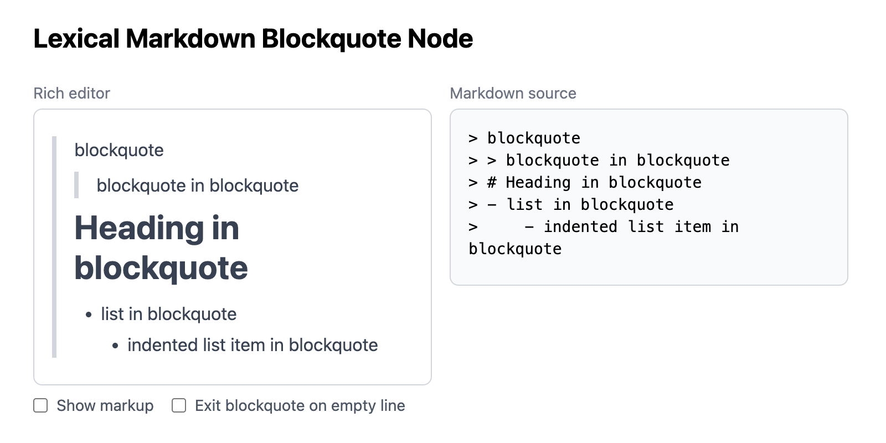

# etude-lexical-markdown-blockquote

A personal study project implementing Markdown-style blockquote editing logic in [Lexical](https://lexical.dev/).

Live demo: https://dayflower.github.io/etude-lexical-markdown-blockquote/

## About

This is an etude — a hands-on exercise for learning, not a production tool. Markdown-style blockquotes look simple on the surface, but preserving a useful rich-text editing flow around nested blocks, lists, and Markdown export requires more explicit behavior than Lexical provides out of the box.

The editor behavior is loosely inspired by common Markdown editors, but is not intended to be a full clone of any one application. The logic was written independently as a focused exploration of blockquote editing in Lexical.

## Features

The UI is a dual-panel layout: a rich editor on the left and a live Markdown source preview on the right.

Supported editing behavior includes Markdown shortcuts for blockquotes, headings, lists, inline styles, and quote-specific handling for Enter, Backspace, empty-line exits, nested blocks, and list exits inside quotes.

## Implementation Notes

See [notes/DESIGN.md](notes/DESIGN.md) for the architecture notes and behavior details.

## License

[MIT](LICENSE)
